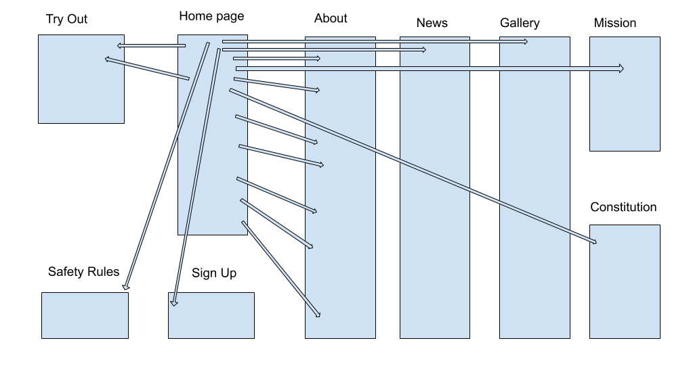

# Limerick Kettlebell Lifting Club

Static website to promote the [Limerick Kettlebell Club](https://www.facebook.com/Limerick-Kettlebell-Club-201978196542853) and [Kettlebell Sport](https://en.wikipedia.org/wiki/Kettlebell_lifting) around Limerick city, Ireland. This project is the first milestone in obtaining a [Full Stack Web Development](https://codeinstitute.net/full-stack-software-development-diploma/) diploma from [Code Institute](https://codeinstitute.net/)

### Attention to the assessors
I kept a journal during the development abou my daily activities, see it [here](./assets/doc/ci-ms1-study-notes-journal.pdf).

## Table of Content
- [1. UX design process](#1-ux-design-process)
  - [1.1 Strategy Plane](#11-strategy-plane)
  - [1.2 Scope plane](#12-scope-plane)
  - [1.3 Structure plane](#13-structure-plane)
  - [1.4 Skeleton plane](#14-skeleton-plane)
  - [1.5 Surface plane](#15-surface-plane)

## 1. UX design process
### 1.1 Strategy Plane
Stakeholders of the website:
- visitor - a person visiting the website, not a club member
- member - club member, who actively trains or trained with the club
- officer - affiliated with the club who executes or organises club matters though official capacity
- AIKLF - sport organization which the club is associated with

#### 1.1.1 Goals and Objectives of Stakeholders (users)
|G#|User|Goals, Needs, Objectives|
|--|----|------------------------|
|G1|AIKLF|member organizations feature their affiliation with national (AIKLF) and world organization (IUKL) in info materials|
|G2|officer|provide adequate, easy access training facilities with certified instructors at fair price in popular day/week times|
|G3|officer|increase number of active members by attracting new members and retaining current members|
|G4|officer|organise workshops for the public and other gym trainers|
|G5|officer|promote the club via members’ social networks|
|G6|officer|make available club documents, rules, photos and forms|
|G7|officer|present an attractive image of the club to the public|
|G8|officer|inform about out of ordinary events (e.g. competition results, upcoming events, closure, etc.)|
|G9|officer|send out low cost instant delivery periodicals and notifications to individuals who signed up for it|
|G10|officer|facilitate calendar where members can sign up to events or cancel the same|
|G11|officer|inform about the history of Kettlebell and Kettlebell Sport|
|G12|visitor|find training community which caters for my particulars and interests (gender, age, experience level, dedication to training)|
|G13|visitor|learn about training related questions of what, why, how, who, when, where|
|G14|visitor|learn about venue facilities: reception, change room, locker, parking, price, discount|
|G15|visitor|learn about tools used for training|
|G16|visitor|learn what to expect on the first training|
|G17|officer|make available template training plans|
|G18|member|our heroes: get information about club related competition results|
|G19|officer|increase our authority on the subject in the eyes of the visitors|

### 1.2 Scope plane
It has been decided to create a static website. In light of that decision we do not go forward with
- G5: this goal would be for presence on a social network site, not for a homepage,
- G10: the calendar functionality would require database and programming, therefore ot of scope for now,
- G17: at the moment could not obtain these training plans

The following table lists the planned features, each feature referenced with original goal(s):

|F#|Goal|Feature|
|--|----|-------|
|F1|G3|build a custom static website with responsive pages for mobile, tablet and desktop|
|F2||have navigation bar on each pages|
|F3|G1, G19|display LKC’s logo and name, display club’s affiliation with AIKLF and IUKL with logo, name and link, provide description about each|
|F4|G16|provide description about how to prepare, what to bring, what to expect on the first training|
|F5|G7, G12|display attractive photos and texts, member testimonials|
|F6|G13, G19|describe what we do|
|F7|G13|describe why we train|
|F8|G13, G19|describe how: training methods|
|F9|G13, G19|describe who we are, how to contact us|
|F10|G13|inform about training times|
|F11|G13|describe where we train including venue facilities|
|F12|G8|present news articles|
|F13|G8, G9, G18|sign up to newsletter (email)|
|F14|G6, G16|ask Medical Form to be filled|
|F15|G3|allow first time applicant to announce self for training, so coach is notified, can learn more beforehand, this way improving first time experience|
|F16|G3, G6, G14|explain membership|
|F20|G10|display an event/training calendar, allow members to sign up/off|

### 1.3 Structure plane
The structure of the website to be built consist of
- a Home page with short leads - all pointing to longer descriptions on the About page,
- a long About page receiving traffic from the landing page with many sections with bookmark navigation, end of all sections refer back to Home with link
- a Sign Up to receive emails page
- a picture Gallery page about training, meetups, competitions
- a News page related to club events
- a Try Out page with every important to know for the first training
- a Mission (statement) page
- a Constitution page

### 1.4 Skeleton plane
Feature list in page/section structure with content hinting and navigation links. 

See the whole document [here](lkc-features.pdf) in PDF format.

### 1.5 Surface plane
Used the website coolors.co to come up with base colors for styling:

Also decided that for secondary colors will use kettlebell weight color codes. See this image for sample of those colors:

Choose font [Roboto](https://fonts.google.com/specimen/Roboto) for the headers.

## Features

In this section, you should go over the different parts of your project, and describe each in a sentence or so.
 
### Existing Features
- Feature 1 - allows users X to achieve Y, by having them fill out Z
- ...

For some/all of your features, you may choose to reference the specific project files that implement them, although this is entirely optional.

In addition, you may also use this section to discuss plans for additional features to be implemented in the future:

### Features Left to Implement
- Another feature idea

## Technologies Used

In this section, you should mention all of the languages, frameworks, libraries, and any other tools that you have used to construct this project. For each, provide its name, a link to its official site and a short sentence of why it was used.

- [JQuery](https://jquery.com)
    - The project uses **JQuery** to simplify DOM manipulation.

## Testing

In this section, you need to convince the assessor that you have conducted enough testing to legitimately believe that the site works well. Essentially, in this part you will want to go over all of your user stories from the UX section and ensure that they all work as intended, with the project providing an easy and straightforward way for the users to achieve their goals.

Whenever it is feasible, prefer to automate your tests, and if you've done so, provide a brief explanation of your approach, link to the test file(s) and explain how to run them.

For any scenarios that have not been automated, test the user stories manually and provide as much detail as is relevant. A particularly useful form for describing your testing process is via scenarios, such as:

1. Contact form:
    1. Go to the "Contact Us" page
    2. Try to submit the empty form and verify that an error message about the required fields appears
    3. Try to submit the form with an invalid email address and verify that a relevant error message appears
    4. Try to submit the form with all inputs valid and verify that a success message appears.

In addition, you should mention in this section how your project looks and works on different browsers and screen sizes.

You should also mention in this section any interesting bugs or problems you discovered during your testing, even if you haven't addressed them yet.

If this section grows too long, you may want to split it off into a separate file and link to it from here.

## Deployment

This section should describe the process you went through to deploy the project to a hosting platform (e.g. GitHub Pages or Heroku).

In particular, you should provide all details of the differences between the deployed version and the development version, if any, including:
- Different values for environment variables (Heroku Config Vars)?
- Different configuration files?
- Separate git branch?

In addition, if it is not obvious, you should also describe how to run your code locally.

## Credits

### Content
- The text for section Y was copied from the [Wikipedia article Z](https://en.wikipedia.org/wiki/Z)

### Media
- The photos used in this site were obtained from ...

### Acknowledgements

- I received inspiration for this project from X